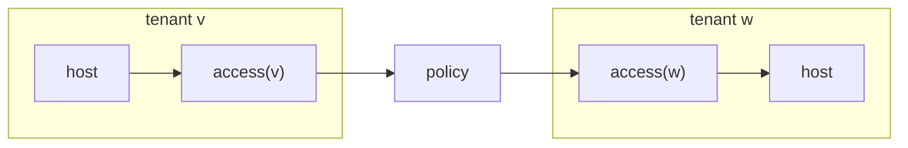
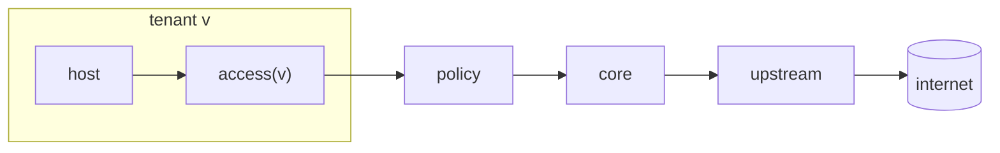
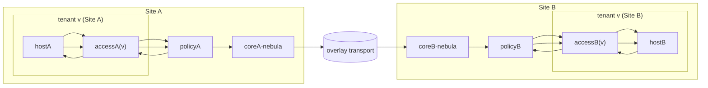

The compiler converts *site intent* into router configuration. These invariants are **laws**:
if any invariant fails, compilation fails.

They describe **packet behavior as derivable from the compiled graph + routing tables**, not
implementation details, naming tricks, or renderer side-effects.

Goals:
- Structural — defined on reachability induced by forwarding state
- Deterministic — independent of naming tricks (no VLAN ranges, no heuristics)
- Minimal — each law blocks a specific failure mode

---

# 1. Model

## 1.1 Roles (node categories)
Within a site graph, nodes are categorized into roles:

- access(tenantVlanId)        = default gateway for tenant VLAN `tenantVlanId`
- policy                      = routing authority
- core                        = transport aggregation only (no service decisions)
- coreUplink(upstreamName)    = attachment to upstream `upstreamName`
- overlay(tenantVlanId)       = tenant-isolated cross-site transport plane for VLAN `tenantVlanId`

These are roles, not identifiers. A compiled node has role metadata, and invariants
must be checked against roles rather than node names.

## 1.2 Link kinds (edge categories)
- lan  = tenant network segment (L2/L3 gateway boundary)
- p2p  = internal routing adjacency (exactly two endpoints)
- wan  = external transport or overlay transport

## 1.3 Tenant prefixes (site-local definitions)
For tenant VLAN `tenantVlanId`:

- tenantIPv4Prefix(tenantVlanId) = ${tenantV4Base}.${tenantVlanId}.0/24
- tenantIPv6Prefix(tenantVlanId) = ${ulaPrefix}:${tenantVlanId}::/64

Define the set of all tenant prefixes in the site:

- tenantIPv4Prefixes = { tenantIPv4Prefix(v) | v in tenantVlanIds }
- tenantIPv6Prefixes = { tenantIPv6Prefix(v) | v in tenantVlanIds }
- tenantPrefixes     = tenantIPv4Prefixes ∪ tenantIPv6Prefixes

## 1.4 Routing objects (compiled output)
The compiled site graph provides, at minimum:

- nodes: nodeId -> nodeRecord
- links: linkId -> linkRecord
- routing: nodeId -> { routes = [ routeRecord... ], ... }

A routeRecord includes:
- destinationPrefix
- nextHopAddress (optional for connected routes)
- outgoingInterfaceId (or link reference)
- metric (optional)

Invariant checks must be expressed only in terms of these compiled structures.

---

# 2. Graph correctness

## G1 — Unique objects (site scope)
Within each site:
- Node identifiers are unique
- Link identifiers are unique
- Each interface belongs to exactly one link

## G2 — Link integrity
For every link `linkId`:
- link.members equals the set of node interfaces referencing `linkId`
- link.endpoints exist for every member
- link.endpoints keys match link.members exactly

## G3 — No phantom references
Every node referenced by:
- route next-hops (by nodeId or by interface/link indirection)
- link members
- endpoint definitions
must exist as a node in the site graph.

---

# 3. Addressing

## A1 — Gateway ownership (tenant LAN)
For each tenantVlanId:
- Only access(tenantVlanId) may originate/advertise:
  - tenantIPv4Prefix(tenantVlanId) on the tenant LAN
  - tenantIPv6Prefix(tenantVlanId) via RA on the tenant LAN
- No other node may originate/advertise that tenant prefix on that tenant LAN.

(Operationally: only access(tenantVlanId) may expose these prefixes on lan links for that tenant.)

## A2 — No overlaps (site scope)
Within a site:
- tenantIPv4Prefix(tenantVlanId) do not overlap each other
- tenantIPv6Prefix(tenantVlanId) do not overlap each other
- Every p2p IPv4 subnet does not overlap any tenantIPv4Prefix
- Every p2p IPv6 subnet does not overlap any tenantIPv6Prefix
- Every wan/overlay transport subnet does not overlap any tenant prefix or p2p subnet

## A3 — Point-to-point shape
For every p2p link:
- IPv4 must be /31
- IPv6 must be /127

---

# 4. Authority & isolation (forwarding-derived)

All invariants in this section must be checkable by analyzing the effective forwarding
state derived from routing tables.

## I1 — Inter-tenant isolation requires policy traversal
For any two distinct tenant VLANs `tenantVlanIdA != tenantVlanIdB`:

Let:
- accessNodeA = access(tenantVlanIdA)
- tenantPrefixB be either tenantIPv4Prefix(tenantVlanIdB) or tenantIPv6Prefix(tenantVlanIdB)

If accessNodeA has a forwarding path to tenantPrefixB, then along the next-hop chain
(from accessNodeA towards tenantPrefixB), node `policy` must appear before reaching
any node in role access(tenantVlanIdB) or before delivering to tenantPrefixB.

Equivalently (chain form):
- Every resolved next-hop chain from access(tenantVlanIdA) to tenantPrefixB contains policy.

## I2 — Core has no tenant decision authority
For every tenantPrefix in tenantPrefixes:

- core must not have any route to tenantPrefix whose next-hop resolves to a node
  not in role policy.

In concrete route predicate form:
- For every route on any core node where route.destinationPrefix ∈ tenantPrefixes:
  nextHopRole(route) must be policy.

Additionally:
- core must not contain default routes (0.0.0.0/0 or ::/0).

## I3 — Policy is complete for tenant return paths
For each tenantVlanId:

Policy must have exactly one effective route to:
- tenantIPv4Prefix(tenantVlanId) whose next-hop resolves to access(tenantVlanId)
- tenantIPv6Prefix(tenantVlanId) whose next-hop resolves to access(tenantVlanId)

(Exactly one means: no ambiguity in forwarding for tenant return.)

## I4 — Access routers are local + default-only-via-policy
For each tenantVlanId, let accessNode = access(tenantVlanId).

Allowed on accessNode:
- connected/local routing for tenantIPv4Prefix(tenantVlanId) and tenantIPv6Prefix(tenantVlanId)
- default routes only if next-hop resolves to policy

Forbidden on accessNode:
- any effective route to any tenant prefix not owned by this accessNode
- any default route whose next-hop does not resolve to policy

---

# 5. Default, upstream, and duplicate-route safety

## U1 — Only policy may originate default routes
Default routes are:
- 0.0.0.0/0
- ::/0

Constraints:
- policy may install default routes
- every non-policy node must not contain default routes,
  except as a route whose next-hop resolves to policy (i.e., “default via policy only”)

## U2 — Capability gating (expressed as absence)
If an upstream attachment is incapable of providing a class of reachability, then
the compiled routing state must not include those routes via that upstream.

This invariant is checked only when the compiled graph marks an upstream as lacking
a capability. In that case, policy must not contain any route in that class whose
next-hop resolves through that upstream.

(Classes and upstream capability flags are site-defined, but the invariant is purely:
“if capability absent, routes of that class via that upstream absent”.)

## U3 — No duplicate routes on the same interface
On any single node, for any single outgoingInterfaceId:
- two identical routes are forbidden.

Identical route definition:
- same destinationPrefix
- same resolved next-hop (same via address or same connected semantics)

## U4 — No WAN-to-WAN transit (anti-bridging)
For any node:
- traffic entering a WAN interface must not be forwarded out a different WAN interface.

Concrete check (forwarding graph form):
- For any route whose outgoingInterface.kind == "wan",
  the next-hop chain must not traverse another wan interface as an egress different from ingress.
(Implementation typically validates absence of a forwarding path from WAN ingress to WAN egress
where ingressWanInterfaceId != egressWanInterfaceId.)

---

# 6. Point-to-point semantics

## P1 — Internal only
For every p2p link:
- it must never be exported to tenant LANs
- it must never carry tenant IPv6 RA prefixes
- it must never be used as an upstream-facing interface

## P2 — Exactly two endpoints
Every p2p link connects exactly two nodes (two endpoints, no more, no less).

## P3 — Required adjacency constraints (route predicates)

### access(tenantVlanId) <-> policy (tenant adjacency)
For each tenantVlanId:
- access(tenantVlanId) must have default route(s) only via policy
- policy must have tenantIPv4Prefix(tenantVlanId) and tenantIPv6Prefix(tenantVlanId) routes via access(tenantVlanId)
- policy must not install default routes via access(tenantVlanId)

### policy <-> coreUplink(upstreamName) (upstream adjacency)
- policy may send upstream traffic via coreUplink(upstreamName) only when not forbidden by U2
- coreUplink(upstreamName) and core:
  - must never install tenant decision routes (I2)
  - must never become a bypass path around policy (I1 + U1)

---

# 7. Overlay tenant planes

Overlay is a tenant-isolated transport domain.
It behaves like a cross-site cable for a single tenant VLAN.

## O1 — Isolation (no cross-tenant overlay routing)
For each tenantVlanId:
- overlay(tenantVlanId) must not contain any effective route to
  tenantIPv4Prefix(otherTenantVlanId) or tenantIPv6Prefix(otherTenantVlanId)
  for any otherTenantVlanId != tenantVlanId.

## O2 — Non-transit (overlay cannot become a general router)
For each tenantVlanId, overlay(tenantVlanId) must not contain:
- default routes (0.0.0.0/0, ::/0) unless explicitly enabled by site intent flag
- internet routes (as classified by site-defined route classes)
- any route to any other tenant’s prefixes

## O3 — Authority preserved (no access -> overlay bypass)
For each tenantVlanId:
- access(tenantVlanId) must not contain any route whose next-hop resolves to overlay(tenantVlanId)
  (or any overlay node).

This forces:
access -> policy -> overlay (if overlay is used), never access -> overlay directly.

## O4 — Symmetry (overlay plane is bidirectional per tenant)
If siteA contains overlay(tenantVlanId) reachability to siteB for tenantVlanId,
then siteB must contain overlay(tenantVlanId) reachability to siteA for tenantVlanId.

(Checked as: if overlay adjacency or overlay peer host-route exists one direction,
a corresponding reverse adjacency/host-route must exist.)

## O5 — Unique adjacency
Exactly one overlay endpoint per (site, tenantVlanId).

## O6 — Unique addressing
Overlay transport subnets must not overlap:
- tenant prefixes
- p2p subnets
- any other overlay transport subnet

## O7 — Overlay not internet by default
Unless explicitly enabled by site intent:
- overlay(tenantVlanId) must not contain default routes.

## O8 — Core unaware of tenant routes via overlay
Core may contain overlay *peer host routes* required for plumbing,
but must not contain tenant prefix routes whose next-hop resolves to any overlay node.

Concrete predicate:
- For any core route where destinationPrefix ∈ tenantPrefixes:
  resolvedNextHopRole must be policy (I2 already), and must not be overlay.

---

# 8. Non-goals (invalid invariants)

These must not appear as invariants:
- VLAN-number rules
- slogans (e.g. "core must be dumb")
- naming conventions
- renderer side-effects
- intent-only statements without a compiled-state predicate

Invariants must constrain forwarding reachability derivable from compiled output only.

---

---

# Appendix A: Routing model (Mermaid)

The following diagram visualizes the required packet paths enforced by the invariants.
It represents allowed forwarding structure — not physical topology.

# Appendix B: Route as client to upstream (internet)

# Appendix C: Cross-site forwarding

