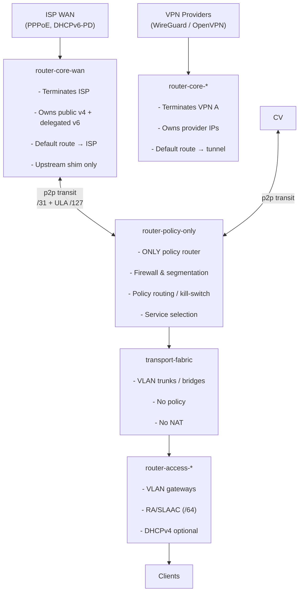

# Router Architecture & Routing Policy

This repository contains a **layered, deterministic, IPv6-first routing architecture**, implemented as a **pure Nix library** and consumed by multiple NixOS systems and containers.

The goal is **not abstraction for abstraction’s sake**, but:

* explicit control
    
* predictable failure modes
    
* auditable routing and policy decisions
    
* clear responsibility boundaries between components
    

The design explicitly accounts for **real-world upstream constraints** (single-address WANs, VPN providers, delegated prefixes, NAT requirements) while keeping the internal topology **stable, explainable, and debuggable**.

* * *

## Repository Scope

This directory (`library/100-fabric-routing`) is **not a full system configuration**.

It provides:

* **pure data** (topology, VLAN semantics, addressing rules)
    
* **derivation logic** (turning topology into networkd + sysctl config)
    
* **debug harnesses** for evaluation without building a system
    

Actual machines and containers **import this library** and render only the pieces they need.

* * *

## Core Principles (Non-Negotiable)

* Each component has **one clearly defined responsibility**
    
* **Policy lives in exactly one place**: `router-policy-only`
    
* Routing decisions are **explicit and auditable**
    
* NAT is a **compatibility shim**, never a design primitive
    
* Internal addressing remains **stable**, regardless of upstream changes
    
* No implicit RA or DHCPv6 on transit links
    
* Transport is dumb; policy is centralized
    

> If a behavior cannot be explained by reading a single intent or topology file, it is considered a design failure.

* * *

## High-Level Architecture

Core routers terminate upstreams.  
`router-policy-only` is the **only policy router**.  
Fabric is **pure transport**.  
Access routers serve clients.



* * *

## Addressing Model

### Internal Addressing (Stable)

All internal infrastructure and VLANs live under a single ULA block:

```
fd42:dead:beef::/48
```

Each VLAN receives a dedicated `/64`.  
These assignments **never depend on upstream state**.

* * *

### Inter-Router Transit Links

Transit links never assign host address `.0` (or `::0`);
endpoints are consistently placed at `.2/.3` regardless of prefix size.

* IPv4: `/31` (preferred) or `/29`
* IPv6: `/127` (preferred) or `/64`

`router-policy-only` → address at offset `+2` within the transit prefix.

### IPv4 examples
* `/31`: usable space is `{2 (policy engine), 3 (other side)}`
* `/29`: usable space is `{2 (policy engine), 3 (other side)}`

### IPv6 examples
* `/127`: `::2` / `::3`
* `/64` (router-only):
  * `::2` policy
  * `::3` peer

Rules:

* RA **disabled**
* DHCPv6 **disabled**
* No prefix delegation
* One VLAN per adjacency
* Routers only — no hosts

Transit exists solely to move packets between policy domains.

* * *

## Responsibility Boundaries

### Core Routers

Core routers exist to **terminate upstreams**.

They may:
* hold provider-assigned addresses
* maintain a default route
* perform the **minimum translation or redirect required** by the upstream
    

They must **never**:
* make service-level decisions
* implement segmentation or firewall policy
* perform selective port forwarding
    

* * *

### `router-policy-only`

This is the **only policy engine**.

Responsibilities include:
* firewall rules
* segmentation
* service exposure
* policy routing / kill-switch semantics
* DNS egress enforcement
* per-VLAN and per-host classification

All policy lives here. Nowhere else.

* * *

### Fabric & Access

* **Fabric**: VLAN trunks, bridges, pure transport
* **Access routers**:
    * act as VLAN gateways
    * provide RA/SLAAC
    * optional DHCPv4
    * no policy logic

* * *

## NAT Is Not Policy

NAT exists **only** to compensate for upstream limitations.

### Case A: Routed Prefix Upstream

* No NAT required
    
* Core routes prefix → `router-policy-only`
    
* Policy router routes to access VLANs
    

### Case B: Single-Address Upstream (`/32` or `/128`)

* Address terminates on the core (provider adjacency)
    
* Core performs a **coarse redirect** to `router-policy-only`
    
* `router-policy-only` decides:
    * which services exist
    * where they go
    * whether they are reachable

> The core makes the uplink usable.  
> The policy router decides everything else.

* * *

## Transitional Reality: `core-isp` Container

During development, a **temporary core-isp container** exists to avoid downtime.

Current state:

* A legacy WAN VLAN (`lan1010`) exists
    
* IPv4 `/29` (`10.255.255.2/29 → 10.255.255.1`) is used temporarily
    
* This is **explicitly transitional**
    
* Final design removes reliance on this path once policy rules are complete
    

This compromise is documented to avoid accidental normalization.

* * *

## Library Structure

```text
lib/
├── fabrics.nix            # VLAN ranges → semantic meaning
├── topology.nix           # Nodes, links, memberships (truth)
├── addressing.nix         # Deterministic p2p addressing
├── get-attrs.nix          # VLAN attribute synthesis
├── mk-links-from-topo.nix # L2/L2.5 rendering (VLANs, bridges)
├── mk-l3-from-topo.nix    # L3 rendering (addresses, routes, sysctls)
├── mk-networkd-vlans.nix  # Legacy helper
└── site-defaults.nix
```

### Debug Harness

```text
debug/
├── debug-eval.nix   # Minimal evalModules harness
├── run.sh           # nix eval wrapper
├── fabrics.nix      # fabric testing
├── get-attrs.nix    # attribute synthesis testing
```

These allow **fast iteration without building systems**.

* * *

## VLAN Semantics

Authoritative VLAN meaning lives in:

```
ROUTING-POLICY.md
```

That document defines:

* trust levels
    
* allowed flows
    
* threat assumptions
    
* reserved ranges
    

The code **consumes** these semantics; it does not redefine them.

* * *

## Design Rationale

This architecture exists to avoid:

* NAT being used as policy
    
* implicit WAN/VPN fallback
    
* DNS leaks under failure
    
* “it works but nobody knows why” configurations
    

It accepts that upstreams are imperfect — and **contains the damage**:

* internal topology stays stable
    
* policy remains centralized
    
* upstream constraints are handled explicitly
    

* * *

## Final Contract

* **Topology is truth**
    
* **Semantics are explicit**
    
* **Policy is centralized**
    
* **Rendering is mechanical**
    
* **Debugging must be possible without guessing**
    

If a route, NAT rule, or firewall decision cannot be explained by pointing to a **single file**, the design is incomplete.


